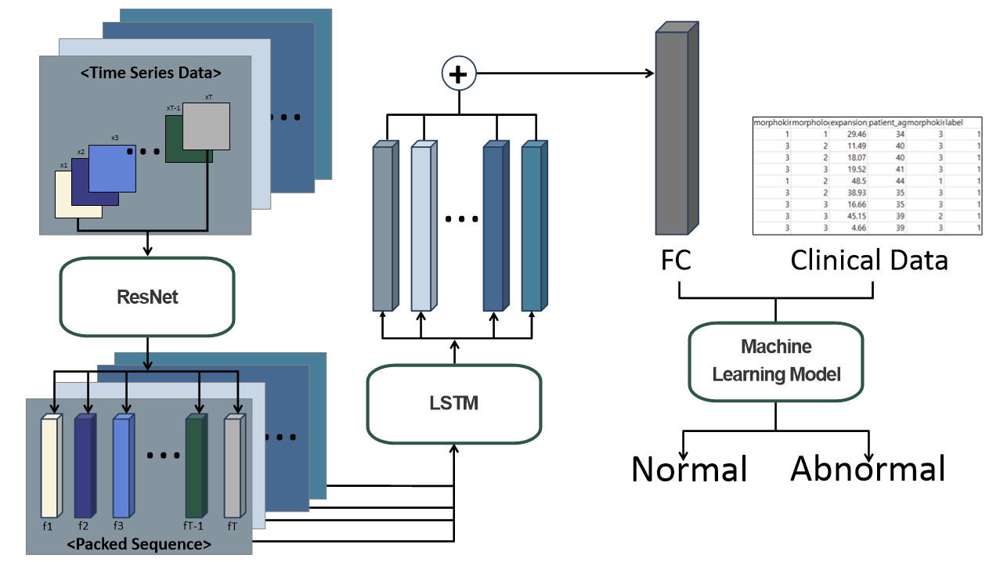
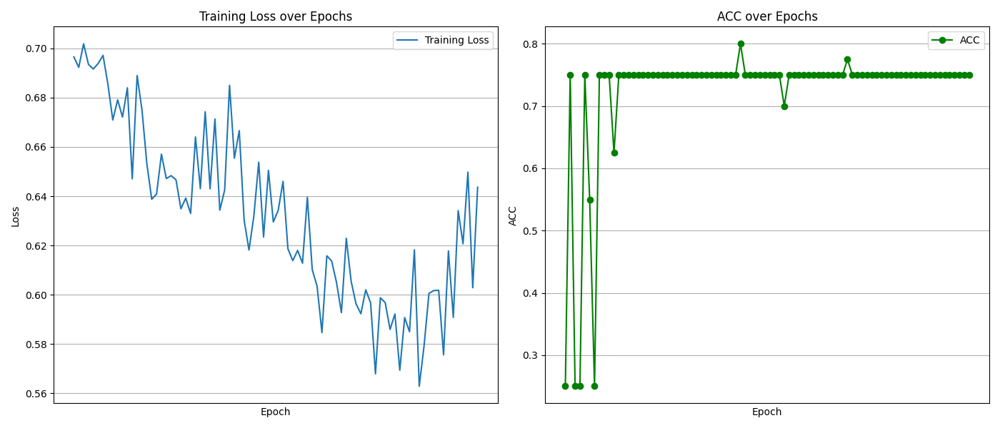
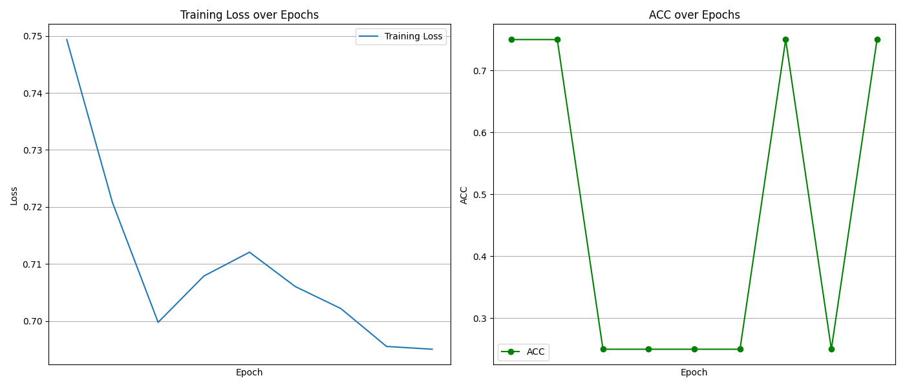
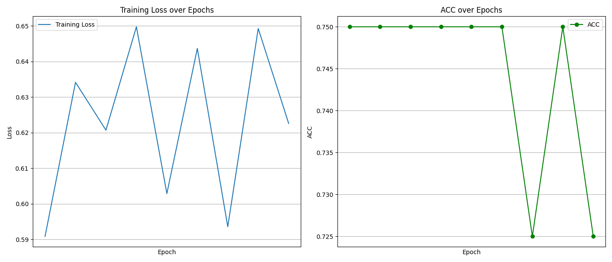
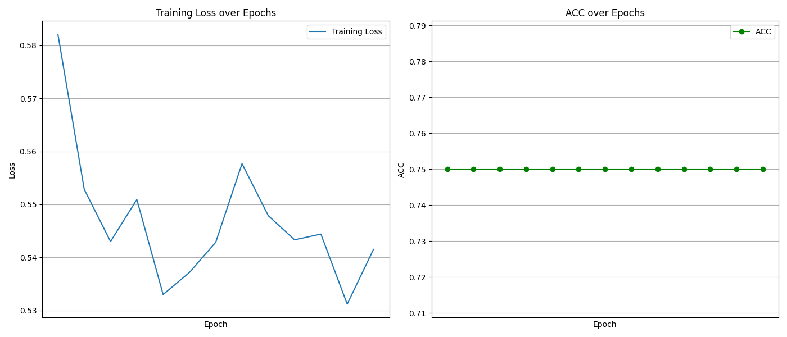
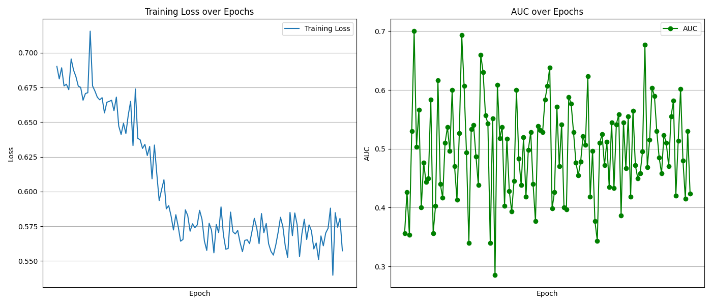
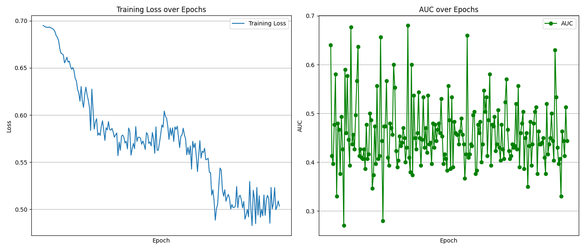
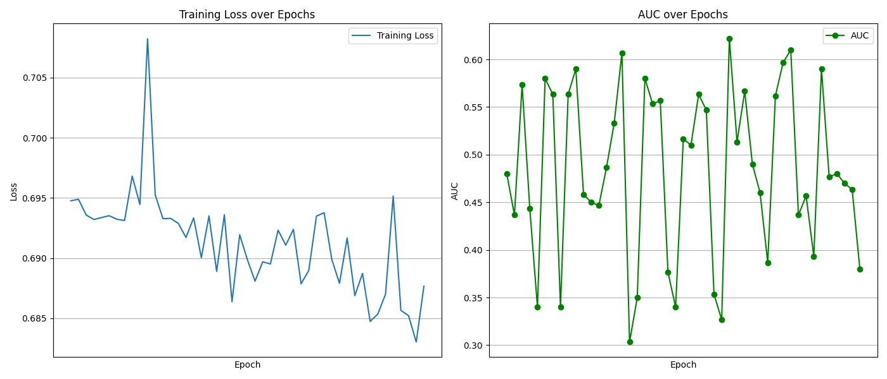
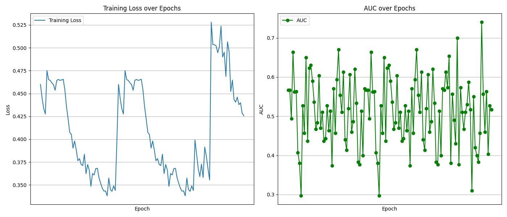

<div align="center">

# Combined ResNet with LSTM
</div>

This folder holds the source code for classifying binary classes(normal, abnormal). 


## 1. Prerequisites
- Python >= 3.9
- PyTorch == 2.4, tested on CUDA 11.7. The models were trained and evaluated on PyTorch 2.4. When testing with other versions, the results (metrics) are slightly different.
- Other dependencies described in `requirements.txt`

the versions described here were the lowest the code was tested with. Therefore, it may also work in other earlier versions, but it is not guaranteed (e.g., the code might run, but with different outputs)

## 2. Install
Conda is not necessary for the installation, as you can see, I only use it for PyTorch and Torchvision.
Nevertheless, the installation process here is described using it.

```bash
$conda create -n laneatt python=3.9 -y
$conda activate resnetlstm
$conda install pytorch==2.4 torchvision -c pytorch
$pip install -r requirements.txt
cd -
```

## 3. Getting started
### Datasets

Your time series datasets should consist of following format :
```bash
data/time_series/
├── folder_1
│   ├── image_1_1.jpg(or .png)
│   ├── image_1_2.jpg
│   └── ...
└── folder_2
    ├── image_2_1.jpg
    └── ...
```

Input csv format of the model :
```
folder_path,morphokinetics_m,morphological_assessment,expansion_rate,patient_age,morphokinetics_bl,label
/* Example
./time_series/data/time_series/folder_1,3,3,7.62,1,3,1
*/
```

## 4. Train
| In train.py
- If you want to use a pre-trained model,
Just put your model's path in model_save_path and Load a model.
- If you want to train without pre-trained model,
you just make a model

```
train_dataset = SequenceDataset.ImageSequenceDataset(csv_file='./input_your_csv_file_path_for_training', transform=transform)

test_dataset = SequenceDataset.ImageSequenceDataset(csv_file='./input_your_csv_file_path_for_testing', transform=transform)

model_save_path = './input_your_pt_file_path'

```

## 5. Test
| In test.py
- Just put your model path in 'model_save_path'
```
model_save_path = 'put_your_model_path.pt'
```

## 6. Results(without clinical data)
|Title|Name of Folder|Score(AUC or ACC)|Metrics|Results|
|------|---|---:|:---:|---|
|Undersampling|undersampling|57.33%|ACC||
|Undersampling + Lr0.005|0.005_망|-|-||
|Entire|entire|64.33 %|AUC||
|Oversampling|oversampling|46.67 %|AUC||
|Augmentation Dataset(just flip)|augmentation|70 %|AUC||
|Augmentation + layer reduction|128_1|67.67 %|AUC||
|Augmentation + layer expansion|aug_layer3|61 %|AUC||
|Augmentation Dataset(flip and color jittering)|aug5_256_2|74 %|AUC||

